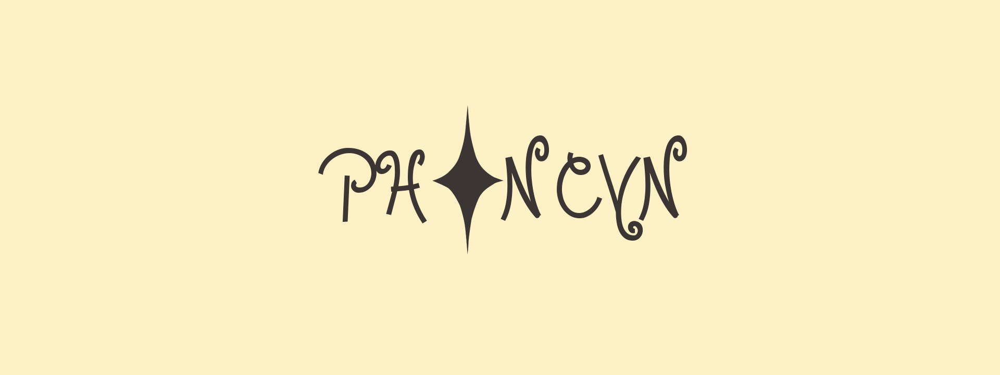

### Hi there 👋, my name is Eugene
#### I'm developer game

My Profile

<a href="https://github.com/phancyn/phancyn/blob/main/My_layout_Unity.wlt">My layout Unity</a>

<a href="https://github.com/phancyn/Top-Assets-For-Unity-Free/tree/main">Unity Asset's Free</a>

I have been living in Russia for 16 years, I strive for a good programmer of Unreal, unity games

Skills: C#, HTML, Git, PHP, CSS, Js, Python

MY PROJECT 👇

  
  

   
     <h1 align="center"><b>NightDay Download, lang: Eng</b></h1>
        

      Star PLS!!!!"
     
    <a href="https://phancyn.itch.io/nightday"><strong>Install on itch »</strong></a>
     
     
    <a href="https://play.google.com/store/apps/details?id=com.Phancyn.NightDay"><strong>Install in Play Market »</strong></a>
     
  

  

  

  
  

   
     <h1 align="center"><b>Enemy Night Download, Lang: Rus</b></h1>
        

      Star PLS!!!!"
     
    <a href="https://phancyn.itch.io/enemy-night"><strong>Install on itch »</strong></a>
     
     
    <a href="https://vk.com/phancyn_official"><strong>Install in VK »</strong></a>
     
  

  

 

  
  

   
     <h1 align="center"><b>ATMOS SOUND</b></h1>
        

       
    <a href="http://atmos-music.ru"><strong>web site »</strong></a>
     
     
     
  

  

  

  
  

   
     <h1 align="center"><b>Fish Launcher(Updater) For Your Game, Lang: Rus</b></h1>
        

      Star PLS!!!!"
     
    <a href="https://github.com/phancyn/Fish-Launcher-Public"><strong>View on Github »</strong></a>
     
     
  

  

